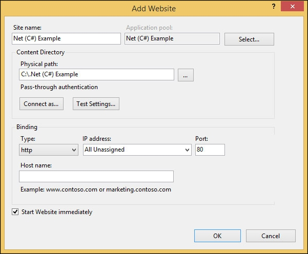
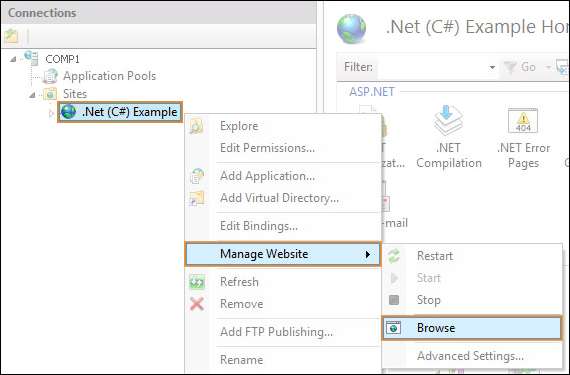

## Overview

This example will help you integrate ONLYOFFICE Docs into your web application written in .Net (C# MVC).

**Please note**: It is intended for testing purposes and demonstrating functionality of the editors. Do NOT use this integration example on your own server without proper code modifications! In case you enabled the test example, disable it before going for production.

## Step 1. Install ONLYOFFICE Docs

Download and install ONLYOFFICE Docs (packaged as Document Server).

See the detailed guide to learn how to install Document Server [for Windows](https://helpcenter.onlyoffice.com/installation/docs-developer-install-windows.aspx), [for Linux](https://helpcenter.onlyoffice.com/installation/docs-developer-install-ubuntu.aspx), or [for Docker](https://helpcenter.onlyoffice.com/server/developer-edition/docker/docker-installation.aspx).

## Step 2. Download the .Net (C# MVC) code for the editors integration

Download the [.Net (C# MVC) example](https://api.onlyoffice.com/editors/demopreview) from our site.

To connect the editors to your website, specify the path to the editors installation and the path to the storage folder in the *web.appsettings.config* file:
```
<add key="storage-path" value=""/>
<add key="files.docservice.url.site" value="https://documentserver/" />
```
where the **documentserver** is the name of the server with the ONLYOFFICE Document Server installed and the **storage-path** is the path where files will be created and stored. You can set an absolute path.

If you want to experiment with the editor configuration, modify the [parameters](https://api.onlyoffice.com/editors/advanced) in the *DocEditor.aspx* file.

## Step 3. Install the prerequisites
Сheck if your system meets the system requirements:
* **Microsoft .NET Framework**: version 4.5 (download it from the [official Microsoft website](https://www.microsoft.com/en-US/download/details.aspx?id=30653));
* **Internet Information Services**: version 7 or later.

Configure the IIS components for the server to work correctly:
1.	Open Windows features:

	**Start** -> **Control Panel** -> **Programs** -> **Programs and Features** -> **Turn Windows features on or off**

2. In the opened window, find **Internet Information Services** and choose all the necessary features. To do this, open the **World Wide Web Services** list and check the following components:
* **Application Development Features**: .NET Extensibility 4.8, ASP.NET 4.8, ISAPI Extensions, ISAPI Filters,
* **Common HTTP Features**: Default Document,
* **Security**: Request Filtering.

## Step 4. Run your website with the editors
1. Run the Internet Information Service (IIS) Manager:

	**Start** -> **Control Panel** -> **System and Security** -> **Administrative Tools** -> **Internet Information Services (IIS) Manager**
2. Add your website in the IIS Manager.

	On the **Connections** panel right-click the **Sites** node in the tree, then click **Add Website**.

	
3. In the **Add Website** dialog box specify the name of the folder with the .Net (C# MVC) project in the **Site name** box.

	Specify the path to the folder with your project in the **Physical Path** box.

	Specify the unique value used only for this website in the **Port** box.

	
4. Check for the .NET platform version specified in IIS Manager for you website. Choose **v4.0.** version.
	
	**Application Pools** -> right-click the platform name -> **Set application Pool defaults** -> **.NET CLR version**

	
5. Browse your website with the IIS Manager:

	Right-click the site -> **Manage Website** -> **Browse**

	

## Step 5. Check accessibility

In case the example and Document Server are installed on different computers, make sure that your server with the example installed has access to the Document Server with the address which you specify instead of **documentserver** in the configuration files. 

Make sure that the Document Server has access to the server with the example installed with the address which you specify instead of **example.com** in the configuration files.

## Important security info

Please keep in mind the following security aspects when you are using test examples:

* There is no protection of the storage from unauthorized access since there is no need for authorization.
* There are no checks against parameter substitution in links, since the parameters are generated by the code according to the pre-arranged scripts.
* There are no data checks in requests of saving the file after editing, since each test example is intended for requests only from ONLYOFFICE Document Server.
* There are no prohibitions on using test examples from other sites, since they are intended to interact with ONLYOFFICE Document Server from another domain.