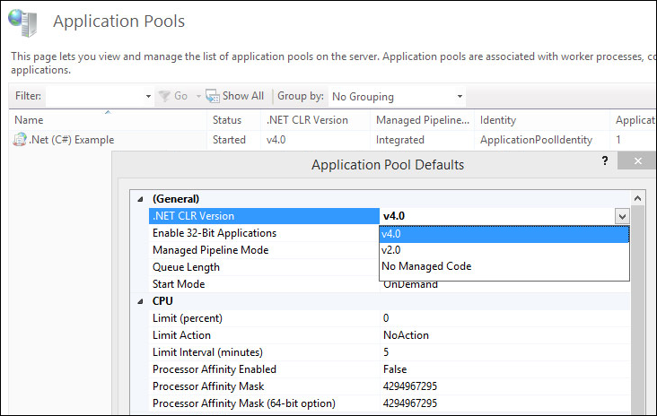

## How to integrate online editors into your own web site on .Net (C#)
### Introduction
To integrate **ONLYOFFICE online editors** into your own website on **.Net (C#)** you need to download and install ONLYOFFICE editors on your local server and use the [.Net (C#) example](https://api.onlyoffice.com/editors/demopreview) for their integration.

Please note that the integration examples are used to demonstrate document editors functions and the ways to connect **Document Server** to your own application. **DO NOT USE** these examples on your own server without **PROPER CODE MODIFICATIONS**!

This guide will show you the sequence of actions to integrate the editors successfully.

### Step 1. Download and Install Document Server

First, download the [**ONLYOFFICE Editors**](https://api.onlyoffice.com/editors/demopreview) (the ONLYOFFICE Document Server).
See the detailed guide to learn how to install Document Server [for Windows](https://helpcenter.onlyoffice.com/installation/docs-developer-install-windows.aspx?from=api_csharp_example), [for Linux](https://helpcenter.onlyoffice.com/installation/docs-developer-install-ubuntu.aspx?from=api_csharp_example), or [for Docker](https://helpcenter.onlyoffice.com/server/developer-edition/docker/docker-installation.aspx?from=api_csharp_example).

### Step 2. Download the .Net (C#) code for the editors integration

Download the [.Net (C#) example](https://api.onlyoffice.com/editors/demopreview) from our site.
You need to connnect the editors to your web site. For that specify the path to the editors installation in the *settings.config* file:
```
<add key="files.docservice.url.site" value="https://documentserver/" />
```
where the **documentserver** is the name of the server with the ONLYOFFICE Document Server installed.
If you want to experiment with the editor configuration, modify the [parameters](https://api.onlyoffice.com/editors/advanced) it the *DocEditor.aspx* file.

### Step 3. Install the prerequisites
To run your website with the editors successfully, check if your system meets the necessary system requirements:
* Microsoft .NET Framework: version 4.5 (download it from the [official Microsoft website](https://www.microsoft.com/en-US/download/details.aspx?id=30653));
* Internet Information Services: version 7 or later.

### Step 4. Running your web site with the editors
1. Run the Internet Information Service (IIS) manager
	Start -> ControlPanel -> System and Security -> Administrative Tools -> Internet Information Services (IIS) Manager
2. Add your web site in the IIS Manager
	On the **Connections** panel right-click the **Sites** node in the tree, then click **Add Website**.
	
3. In the **Add Website** dialog box specify the name of the folder with the .Net (C#) project in the **Site name** box.
	Specify the path to the folder with your project in the **Physical Path** box.
	Specify the unique value used only for this website in the **Port** box.
	
4. Check for the .NET platform version specified in IIS manager for you web site. Choose **v4.0.** version.
	Click the **Application Pool** -> right-click the platform name -> **Set application Pool defaults** -> **.NET CLR version**
	
5. Browse your web site with the IIS manager:
	Right-click the site -> **Manage Website** -> **Browse**
	

### Step 5. Checking accessibility

In case the example and Document Server are installed on different computers, make sure that your server with the example installed has access to the Document Server with the address which you specify instead of **documentserver** in the configuration files. And you must also make sure that the Document Server in its turn has access to the server with the example installed with the address which you specify instead of **example.com** in the configuration files.
If you integrated the editors successfully the result should look like the [demo preview](https://api.onlyoffice.com/editors/demopreview#DemoPreview) on our site.