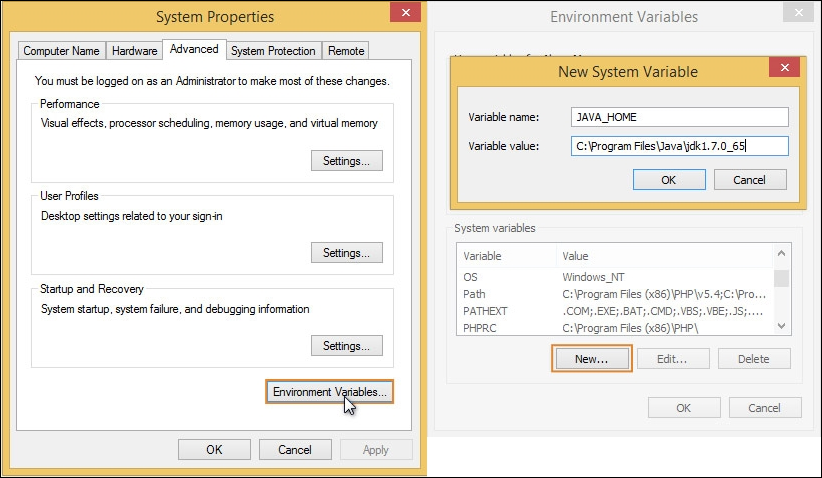
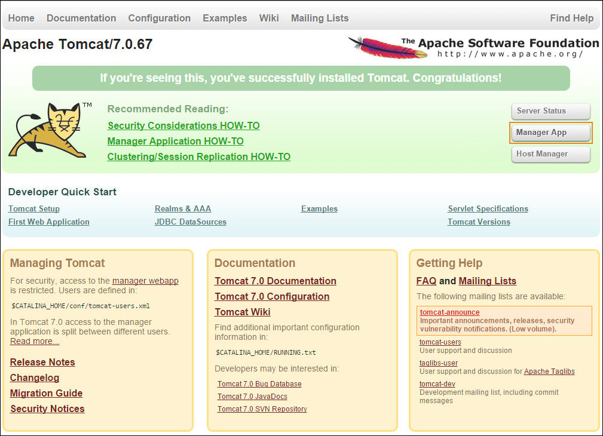
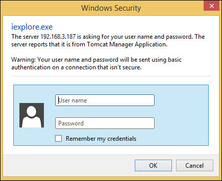
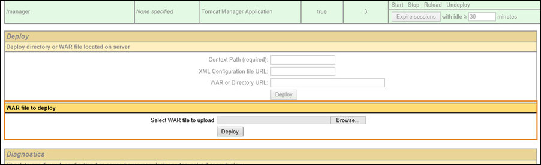
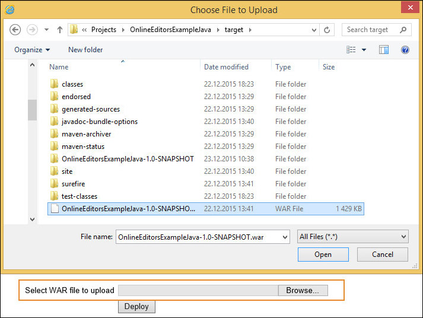
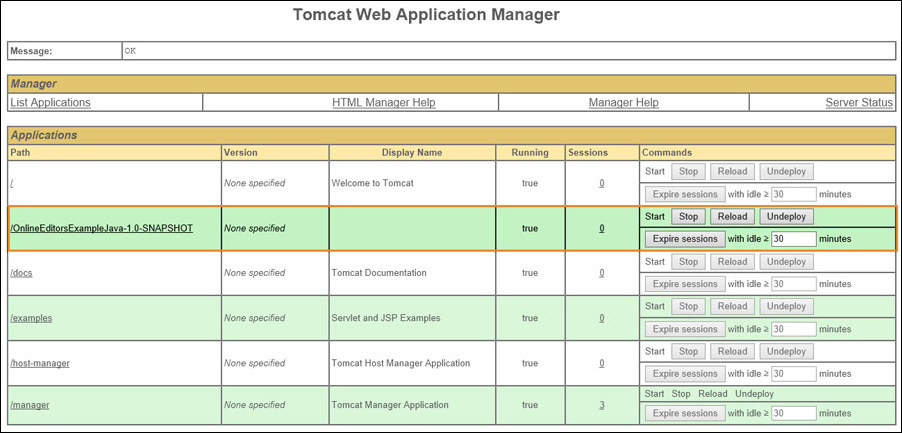

## Overview

This example will help you integrate ONLYOFFICE Docs into your web application written in Java.

**Please note**: It is intended for testing purposes and demonstrating functionality of the editors. Do NOT use this integration example on your own server without proper code modifications! In case you enabled the test example, disable it before going for production.

## For Windows

### Step 1. Install ONLYOFFICE Docs

Download and install ONLYOFFICE Docs (packaged as Document Server).

See the detailed guide to learn how to [install Document Server for Windows](https://helpcenter.onlyoffice.com/installation/docs-developer-install-windows.aspx). 

### Step 2. Download the Java code for the editors integration

Download the [Java example](https://api.onlyoffice.com/editors/demopreview) from our site.

To connect the editors to your website, specify the path to the editors installation and the path to the storage folder in the *src/main/resources/settings.properties* file:

```
storage-folder = app_data
files.docservice.url.site=https://documentserver/
```

where the **documentserver** is the name of the server with the ONLYOFFICE Document Server installed and the **storage-folder** is the path where files will be created and stored. You can set an absolute path. For example, *D:\\\\folder*. Please note that on Windows OS the double backslash must be used as a separator.

If you want to experiment with the editor configuration, modify the [parameters](https://api.onlyoffice.com/editors/advanced) in the *\src\main\webapp\editor.jsp* file.

### Step 3. Install the prerequisites

To run the Java example code, install the Java version appropriate for your OS and web server **Apache Tomcat**:

* **Java** (download from [the Oracle official website](https://www.java.com/en/download/manual.jsp));
* **Apache Tomcat** (download from [the official website](http://tomcat.apache.org/)).

### Step 4. Run Apache Tomcat

1. After you have installed Java on Windows, set the **JAVA_HOME** environment variable to point to the Java installation directory.

	Find out where Java is installed. If you didn't change the path during installation, it will be something like this:

	```
	C:\Program Files\Java\jdk1.8.0_65
	```

	In **Windows 7**, right click **My Computer** and select **Properties**, then click **Advanced**.

	In **Windows 8**, go to **Control Panel** and select **System**, then click **Advanced System Settings**.

	Click the **Environment Variables** button.

	Under **System Variables**, click **New**.

	In the **Variable Name** field, enter **JAVA_HOME** if you installed the **JDK** (Java Development Kit) or **JRE_HOME** if you installed the **JRE** (Java Runtime Environment).

	In the **Variable Value** field, enter your **JDK** or **JRE** installation path, for example *C:\Program Files\Java\jdk1.8.0_65*.

	

	Check if the variable created successfully by **echo** command in the **Command Prompt**:

	```
	echo %JAVA_HOME%
	```

2. Run the **Command Prompt**. Change the current directory for the **Apache Tomcat** installation directory:

	```
	cd /d C:\Apache Tomcat\apache-tomcat-7.0.67\bin
	```

3. Use the bin *startup.bat* script to start Apache Tomcat:

	```
	startup.bat
	```

	You will see the new **Tomcat** console window displayed that provides the information and messages about Tomcat startup:

	

	Test your Tomcat installation using the address in a web browser:

	```
	http://localhost:8080
	```

	If everything is correct, you will see the Tomcat web page in the browser as shown below.

### Step 5. Run the Java code

1. Open Tomcat Web Application Manager by clicking **Manager App:**

	

2. Tomcat Web Application Manager will request the **username** and the **password:**

	


	Specify user data in *tomcat-users.xml* file in the Apache Tomcat installation folder. Define the **manager-gui** user role, specify the **user name** and **password** values:

	```
	<tomcat-users>
		<role rolename="manager-gui"/>
		<user username="tomcat" password="tomcat" roles="manager-gui"/>
	</tomcat-users>
	```
3. Build the project using the following commands
	```
	mvn clean
	mvn package
	```
4. Upload the Java project in Tomcat Web Application Manager. For that click **Choose File** in the **WAR file to deploy** section and find the *.war* file in the Java project folder, then click **Deploy**.

	

	 

5. You will see the project in the **Application List**:

	 

6. Click the link with the application name to run it.

### Step 6. Check accessibility

In case the example and Document Server are installed on different computers, make sure that your server with the example installed has access to the Document Server with the address which you specify instead of **documentserver** in the configuration files. 

Make sure that the Document Server has access to the server with the example installed with the address which you specify instead of **example.com** in the configuration files.

## For Linux

### Step 1. Install ONLYOFFICE Docs

Download and install ONLYOFFICE Docs (packaged as Document Server). 

See the detailed guide to learn how to [install Document Server for Linux](https://helpcenter.onlyoffice.com/installation/docs-developer-install-ubuntu.aspx). 

### Step 2. Install the prerequisites and run the website with the editors

1. Install **Java** following the instructions [here](https://docs.oracle.com/en/java/javase/20/install/installation-jdk-linux-platforms.html#GUID-737A84E4-2EFF-4D38-8E60-3E29D1B884B8).

2. Download the archive with the Java example and unpack the archive:

    ```
    wget https://api.onlyoffice.com/app_data/editor/Java.Example.zip
    ```
    
    ```
    unzip Java.Example.zip
    ```

3. Change the current directory for the project directory:

    ```
   cd Java\ Example/
   ```

4. Edit the *src/main/resources/settings.properties* configuration file. Specify the name of your local server with the ONLYOFFICE Document Server installed.

    ```
    nano src/main/resources/settings.properties
    ```

	Edit the following lines:

    ```
    storage-folder = app_data
    files.docservice.url.site=https://documentserver/
    ```

	where the **documentserver** is the name of the server with the ONLYOFFICE Document Server installed and the **storage-folder** is the path where files will be created and stored. Please note that you must have read and write permissions to the folder. If you do not have them, please use the next command:
	```
	sudo chmod -R ugo+rw /{path}
	```

5. Install **Maven**:

    ```
    sudo apt-get install maven
    ```
    
6. Build:

    ```
    mvn package
    ```

7. Install **Tomcat** with the administration page:

    ```
    sudo apt-get install tomcat8 tomcat8-admin
    ```

8. Configure the admin user on Tomcat:

    ```
    sudo nano /var/lib/tomcat8/conf/tomcat-users.xml
    ```

   Insert the lines:

    ```
    <role rolename="manager-gui"/>
    <user username="USERNAME" password="PASSWORD" roles="manager-gui"/>
    ```

	where the **USERNAME** and **PASSWORD** are your own credentials data.

	Restart Tomcat:

	```
	systemctl restart tomcat8
	```

9. Open the Tomcat administration page in browser with the admin user credentions:

    ```
    http://localhost:8080/manager/html
    ```

10. Select the WAR file to upload from *target/OnlineEditorsExampleJava-1.0.war*.

11. See the result in your browser using the address:

    ```
    http://localhost:8080/OnlineEditorsExampleJava-1.0/
    ```
    
### Step 3. Check accessibility

In case the example and Document Server are installed on different computers, make sure that your server with the example installed has access to the Document Server with the address which you specify instead of **documentserver** in the configuration files. 

Make sure that the Document Server has access to the server with the example installed with the address which you specify instead of **example.com** in the configuration files.

## For Docker

### Step 1. Install ONLYOFFICE Docs

Download and install ONLYOFFICE Docs (packaged as Document Server). 

See the detailed guide to learn how to install Document Server [for Docker](https://helpcenter.onlyoffice.com/installation/docs-developer-install-docker.aspx). 

### Step 2. Install the prerequisites and run the website with the editors

1. Install **Java** following the instructions [here](https://docs.oracle.com/en/java/javase/20/install/installation-jdk-linux-platforms.html#GUID-737A84E4-2EFF-4D38-8E60-3E29D1B884B8).

2. Download the archive with the Java example and unpack the archive:

    ```
    wget https://api.onlyoffice.com/app_data/editor/Java.Example.zip
    ```
    
    ```
    unzip Java.Example.zip
    ```

3. Change the current directory for the project directory:

    ```
   cd Java\ Example/
   ```

4. Edit the *src/main/resources/settings.properties* configuration file. Specify the name of your local server with the ONLYOFFICE Document Server installed:

	```
	nano src/main/resources/settings.properties
	```
	
5. Edit the following lines:

	```
	storage-folder = app_data
	files.docservice.url.site=https://documentserver/
	```

	where the **documentserver** is the name of the server with the ONLYOFFICE Document Server installed and the **storage-folder** is the path where files will be created and stored.

6. Run the next command in the Java example directory:

	```
	docker-compose up
	```

7. After it, all the *bin* files will be passed to the *./target* folder.

### Step 3. Check accessibility

In case the example and Document Server are installed on different computers, make sure that your server with the example installed has access to the Document Server with the address which you specify instead of **documentserver** in the configuration files. 

Make sure that the Document Server has access to the server with the example installed with the address which you specify instead of **example.com** in the configuration files.

## Important security info

Please keep in mind the following security aspects when you are using test examples:

* There is no protection of the storage from unauthorized access since there is no need for authorization.
* There are no checks against parameter substitution in links, since the parameters are generated by the code according to the pre-arranged scripts.
* There are no data checks in requests of saving the file after editing, since each test example is intended for requests only from ONLYOFFICE Document Server.
* There are no prohibitions on using test examples from other sites, since they are intended to interact with ONLYOFFICE Document Server from another domain.