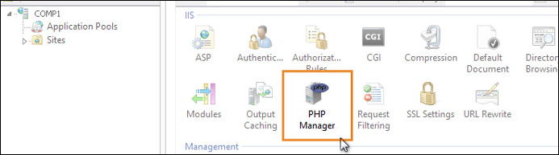
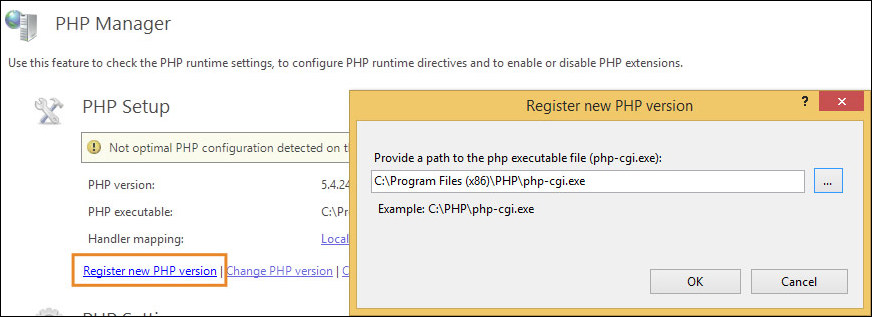
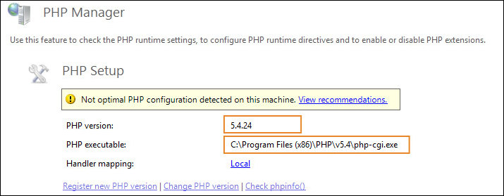
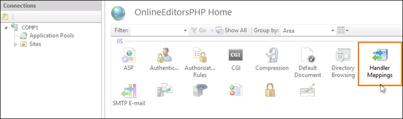
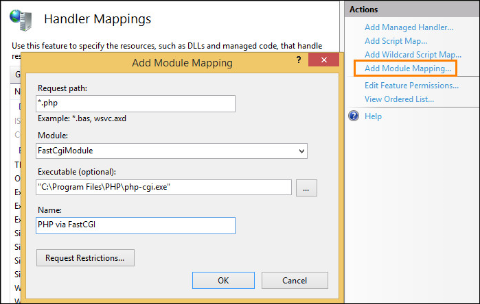
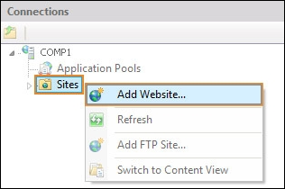
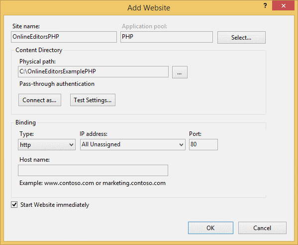
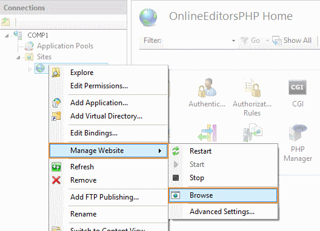

## Overview

This example will help you integrate ONLYOFFICE Docs into your web application written in PHP.

**Please note**: It is intended for testing purposes and demonstrating functionality of the editors. Do NOT use this integration example on your own server without proper code modifications! In case you enabled the test example, disable it before going for production.

## For Windows

### Step 1. Install ONLYOFFICE Docs

Download and install ONLYOFFICE Docs (packaged as Document Server).

See the detailed guide to learn how to [install Document Server for Windows](https://helpcenter.onlyoffice.com/installation/docs-developer-install-windows.aspx?from=api_php_example).

### Step 2. Download the PHP code for the editors integration

Download the [PHP example](https://api.onlyoffice.com/editors/demopreview) from our site.

To connect the editors to your website, specify the path to the editors installation and the path to the storage folder in the *config.json* file:

```
"storagePath" = "";
"docServSiteUrl" = "https://documentserver/";
```

where the **documentserver** is the name of the server with the ONLYOFFICE Document Server installed and the **storagePath** is the path where files will be created and stored. You can set an absolute path. For example, *D:\\\\folder*. Please note that on Windows OS the double backslash must be used as a separator.

If you want to experiment with the editor configuration, modify the [parameters](https://api.onlyoffice.com/editors/advanced) in the *doceditor.php* file.

### Step 3. Install the prerequisites

You can use any web server capable of running PHP code to run the example. We will demonstrate how to run the PHP example using the **Internet Information Services (IIS)** web server. To set up and configure PHP on IIS, **PHP Manager for IIS** will be used.

* **IIS**: version 7 or later (refer to [Microsoft official website](https://www.iis.net/learn/application-frameworks/scenario-build-a-php-website-on-iis/configuring-step-1-install-iis-and-php) to learn how to install IIS);
* **PHP** (download it from the [http://php.net](https://php.net/downloads.php) site);
* **PHP Manager for IIS** (download it from the [Microsoft open source site](https://phpmanager.codeplex.com/releases/view/69115)).
* **Composer** (download it from the [Composer official website](https://getcomposer.org/download/)).

### Step 4. IIS configuration

1. **PHP Manager for IIS** configuration.

    After PHP Manager for IIS installation is complete, launch the **IIS Manager:**

    **Start** -> **Control Panel** -> **System and Security** -> **Administrative Tools** -> **Internet Information Services (IIS) Manager**

    and find the **PHP Manager** feature in the **Features View** in IIS.

    

    You need to register the installed PHP version in IIS using PHP Manager.

    Double-click **PHP Manager** to open it, click the **Register new PHP version** task and specify the full path to the main PHP executable file location. For example: *C:\Program Files\PHP\php-cgi.exe*.

    

    After clicking **OK**, the new **PHP version** will be registered with IIS and will become active.

    

2. Configure IIS to handle PHP requests.

    For IIS to host PHP applications, you must add handler mapping that tells IIS to pass all the PHP-specific requests to the PHP application framework by using the **FastCGI** protocol.

    Double-click the **Handler Mappings** feature:

    

    In the **Action** panel, click **Add Module Mapping**. In the **Add Module Mapping** dialog box, specify the configuration settings as follows:

    * **Request path**: *.php,
    * **Module**: FastCgiModule,
    * **Executable**: "C:\[Path to your PHP installation]\php-cgi.exe",
    * **Name**: PHP via FastCGI.

    Click **OK**.

    

    After IIS manager configuration is complete, everything is ready for running the PHP example.

### Step 5. Run *composer install*:

    ```
    php composer.phar install
    ```

### Step 6. Run your website with the editors

1. Add your website in the IIS Manager.

    On the **Connections** panel right-click the **Sites** node in the tree, then click **Add Website**.

      

2. In the **Add Website** dialog box, specify the name of the folder with the PHP project in the **Site name** box.

    Specify the path to the folder with your project in the **Physical path** box.

    Specify the unique value used only for this website in the **Port** box.

      

3. Browse your website with the IIS manager:

   Right-click the site -> **Manage Website** -> **Browse**

    

### Step 7. Check accessibility

In case the example and Document Server are installed on different computers, make sure that your server with the example installed has access to the Document Server with the address which you specify instead of **documentserver** in the configuration files. 

Make sure that the Document Server has access to the server with the example installed with the address which you specify instead of **example.com** in the configuration files.

## For Linux

### Step 1. Install ONLYOFFICE Docs

Download and install ONLYOFFICE Docs (packaged as Document Server).

See the detailed guide to learn how to [install Document Server for Linux](https://helpcenter.onlyoffice.com/installation/docs-developer-install-ubuntu.aspx?from=api_php_example).

### Step 2. Install the prerequisites and run the website with the editors

1. Install **Apache** and **PHP**:

    ```
    apt-get install -y apache2 php7.0 libapache2-mod-php7.0
    ```

2. Install **Composer**:

    To install composer globally, use the following command which will download and install Composer as a system-wide command named composer, under /usr/local/bin:

    ```
    curl -sS https://getcomposer.org/installer -o /tmp/composer-setup.php
    sudo php /tmp/composer-setup.php --install-dir=/usr/local/bin --filename=composer
    ```

3. Download the archive with the PHP example and unpack the archive:

    ```
    cd /var/www/html
    ```

    ```
    wget https://api.onlyoffice.com/app_data/editor/PHP.Example.zip
    ```

    ```
    unzip PHP.Example.zip
    ```

4. Change the current directory for the project directory:

    ```
    cd PHP\ Example/
    ```

5. Edit the *config.json* configuration file. Specify the name of your local server with the ONLYOFFICE Document Server installed.

    ```
    nano config.json
    ```

    Edit the following lines:

    ```
    "storagePath" = "";
    "docServSiteUrl" = "https://documentserver/";
    ```

    where the **documentserver** is the name of the server with the ONLYOFFICE Document Server installed and the **STORAGE_PATH** is the path where files will be created and stored. You can set an absolute path.

6. Run *composer install*:

    ```
    php composer.phar install
    ```
7. Set permission for site:

    ```
    chown -R www-data:www-data /var/www/html
    ```

8. Restart apache:

    ```
    service apache2 restart
    ```

9. See the result in your browser using the address:

    ```
    http://localhost/PHP%20Example/
    ```

### Step 3. Check accessibility

In case the example and Document Server are installed on different computers, make sure that your server with the example installed has access to the Document Server with the address which you specify instead of **documentserver** in the configuration files. 

Make sure that the Document Server has access to the server with the example installed with the address which you specify instead of **example.com** in the configuration files.

## Important security info

Please keep in mind the following security aspects when you are using test examples:

* There is no protection of the storage from unauthorized access since there is no need for authorization.
* There are no checks against parameter substitution in links, since the parameters are generated by the code according to the pre-arranged scripts.
* There are no data checks in requests of saving the file after editing, since each test example is intended for requests only from ONLYOFFICE Document Server.
* There are no prohibitions on using test examples from other sites, since they are intended to interact with ONLYOFFICE Document Server from another domain.